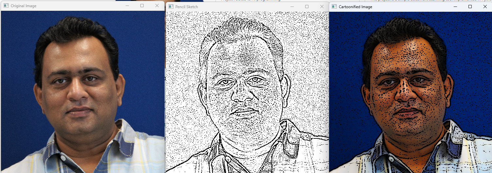

# Pencil Sketch and Cartoonify Image Transformation

This Python project allows you to convert an image into a **pencil sketch** or a **cartoonized version** using OpenCV. The transformations use various image processing techniques such as grayscale conversion, edge detection, Gaussian blur, and color manipulation to generate creative versions of your input image.

---

## Features
- **Pencil Sketch**: Converts a color image into a pencil sketch representation using edge detection and thresholding.
- **Cartoonify**: Converts a color image into a cartoon-styled version by blending edge detection with vibrant color enhancements.

---

## How It Works
1. **Pencil Sketch**:
   - The image is first converted to grayscale.
   - A Gaussian blur is applied to the grayscale image.
   - The Laplacian edge detector is used to detect edges in the image.
   - Thresholding is applied to create the final pencil sketch effect.

2. **Cartoonify**:
   - The image is converted to grayscale, and then a Gaussian blur is applied.
   - Laplacian edge detection highlights the contours of the image.
   - Bilateral filtering is used to smooth the image while retaining the sharp edges.
   - The saturation of the image is increased for a more vibrant look.
   - The final cartoon image is created by combining the vibrant image with the edge mask.

---

## How to run
`pip install opencv-python-headless numpy`
  
### **Usage**

1.**Run the script:**
`python instagram-filters.py`
